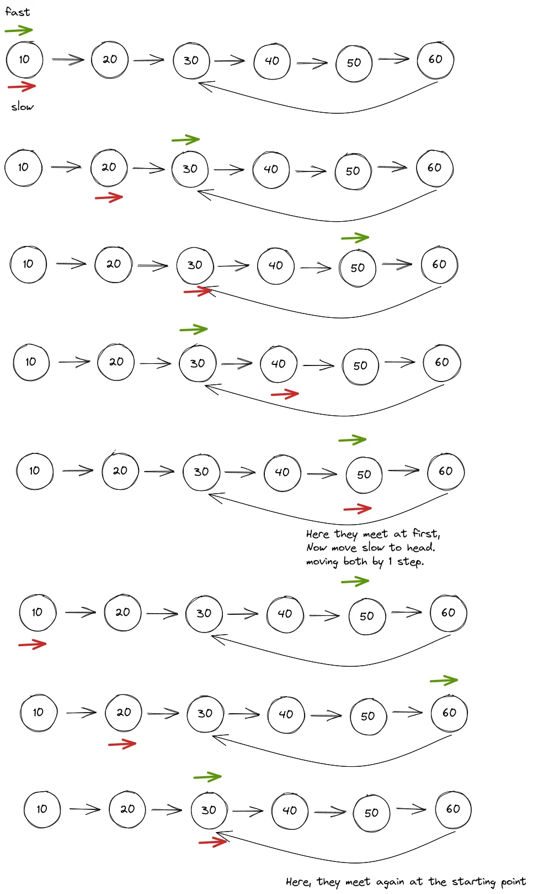

# DSA Patterns

Data Structures
- Array
- Linked List
- Stack
- Queue
- Heap
- Tree
- Trie
- Graph
- Hash Table
- Set
- Map

## 1. Prefix Sum

At its core, prefix sum is about **precomputing cumulative information** so you can answer range queries in O(1) instead of O(n).

Let's say you have array [0, 1, 2, 3, 4, 5]

You want to be able to compute a range sum (ex. sum of numbers from index 1 to index 3 -> `sum(1,3) = 1 + 2 + 3 = 6`). 

```
sum(0,5) = p[0] + p[1] + p[2] + p[3] + p[4] = 0 + 1 + 2 + 3 + 4 = 10
sum(1,4) = p[1] + p[2] + p[3] + p[4] = 1 + 2 + 3 + 4 = 10
sum(2,4) = p[2] + p[3] + p[4] = 2 + 3 + 4 = 9
sum(left, right) = p[left] + ... + p[right]
```

See how we keep recomputing the same things. The sum from index 0 up until index `right` is always the same. Therefore, we can create an array of precomputed sums, where the sum at each index `right` is `sum(0, right)`.

```
a = [0, 1, 2, 3, 4, 5]
p = [0, 1, 3, 6, 10, 15]
```

We now can determine the sum from 0 to any variable right idex `right`. But, we can also compute from any variable left index `left` by discarding the left adjacent sum:

```
sum(2,4) = p[right] - p[left - 1] = p[4] - p[1] = 10 - 1 = 9
```

### Build Prefix Sum

```python
def build_prefix_sum(nums):
    prefix = [0] * len(nums)
    prefix[0] = nums[0]

    for i in range(1, len(nums)):
        prefix[i] = prefix[i - 1] + nums[i]

    return prefix
```

### Query Range Sum

```python
def range_sum(prefix, left, right):
    if left == 0:
        return prefix[right]
    return prefix[right] - prefix[left - 1]
```

### Key Insights

Prefix sum is not just about sums - it’s about **transforming problems into cumulative relationships**

Edge case: When left = 0, there is no `prefix[left - 1]`. In this case, `sum(0, right) = prefix[right]`.

### When To Use

## 2. Sliding Window

Sliding window is a powerful problem-solving pattern where you use **two pointers** to define a “window” and slide them over a data structure, typically an array or a string to find subarrays or substrings that meet a certain requirement.

The power comes from **incremental updates**. When sliding from one position to the next:
- We **lose one** element (the one leaving the window on the left)
- We **gain one** element (the one entering the window on the right)
- Everything else stays the same

```
[1, 2, 3, 4, 5]
 ^     ^
 L     R

[1, 2, 3, 4, 5]
    ^     ^
    L     R

[1, 2, 3, 4, 5]
       ^     ^
       L     R
```

Brute force
```
Window [0, 2]: sum = nums[0] + nums[1] + nums[2]
Window [1, 3]: sum = nums[1] + nums[2] + nums[3]  // Recalculates nums[1], nums[2]
Window [2, 4]: sum = nums[2] + nums[3] + nums[4]  // Recalculates nums[2], nums[3]
```

Using sliding window
```
Window [0, 2]: sum = nums[0] + nums[1] + nums[2]
Window [1, 3]: sum = previous_sum - nums[0] + nums[3]  // O(1) update!
Window [2, 4]: sum = previous_sum - nums[1] + nums[4]  // O(1) update!
```

### Variable Size (Dynamic) Window

Instead of keeping the window size static, the window size changes throughout iteration by using two pointers, left and right, where **right expands** the window and **left contracts** it.

The general pattern is: expand until a condition is **violated**, then shrink until the condition is **restored**.

### When To Use

## 3. Fast & Slow Pointers

The fast and slow pointer (a.k.a. "tortoise and hare" a.k.a "Floyd's Algorithm") is a **two-pointer** technique where you move two pointers through a structure (often a linked list) at different speeds to reveal patterns you can’t see with a single pass.
- **Slow pointer** → moves 1 step at a time
- **Fast pointer** → moves 2 (or more) steps at a time

You can use this pattern to
- Detect cycles
- Find the start of a cycle
- Find the middle of a linked list

### Visualization

In this example, this pattern is used to find the start of a cycle



Think of a race track:
- If there’s **no loop** → fast runs off the track (hits None)
- If there is a **loop** → fast eventually laps slow → collision

### Finding the Middle

```python
def find_middle(head):
    slow = head
    fast = head

    # Move until fast reaches the end
    while fast is not None and fast.next is not None:
        slow = slow.next          # move slow by 1
        fast = fast.next.next     # move fast by 2

    return slow  # slow is at the middle
```

### Cycle Detection

```python
def has_cycle(head) -> bool:
    slow = head
    fast = head

    while fast is not None and fast.next is not None:
        slow = slow.next
        fast = fast.next.next

        # If they meet, there's a cycle
        if slow is fast:
            return True

    # Fast reached the end, no cycle
    return False
```

### Finding Cycle Start

```python
def find_cycle_start(head):
    slow = head
    fast = head

    # Phase 1: detect cycle and find meeting point
    while fast is not None and fast.next is not None:
        slow = slow.next
        fast = fast.next.next

        if slow is fast:
            # Phase 2: find cycle start
            pointer = head
            while pointer is not slow:
                pointer = pointer.next
                slow = slow.next
            return slow  # cycle start

    return None  # no cycle
```

### Key Insights

The beauty of this pattern lies in how efficiently it solves these type of problems. It only uses O(n) time and O(1) space complexity, which means it's both fast and memory-efficient.

- For example, finding the start of a cycle, you could tranverse a linked list with a single pointer, hashing node values by saving them to a `Set`, and detecting if any encountered node is already in the set. This results in O(n) time AND space complexity

## 4. In-place Linked List Reversal
## 5. Monotonic Stack
## 6. Top K Elements
## 7. Overlapping Intervals / Merge Intervals
## 8. Modified Binary Search
## 9. Binary Search
## 10. Binary Tree Traversal
## 11. Depth-First Search (DFS)
## 12. Breadth-First Search (BFS)
## 13. Matrix Traversal
## 14. Backtracking
## 15. Dynamic Programming
## 16. Greedy Algorithms
## 17. Topological Sort
## 18. Trie (Prefix Tree)
## 19. Cyclic Sort
## 20. Two Heaps
## 21. Subsets
## 22. Bitwise XOR
## 23. K-way Merge
## 24. 0/1 Knapsack